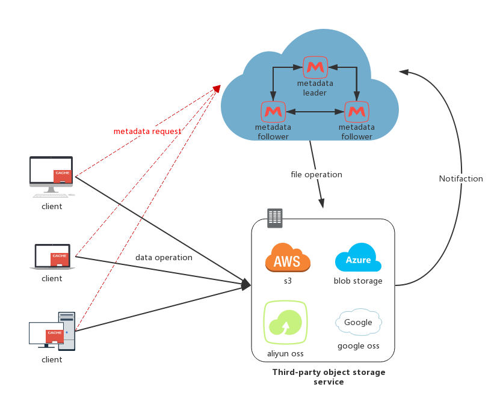

Introduction
------------

## Architecture
The general architecture  of the GoFS has three main components:
* the third-party cloud storage for the file data
* the metadata cluster service for managing the metadata and to support synchronization
* the client that implements most of the GoFS functionality, and corresponds to the file system client mounted at the user machine.

## Details
### Metadata server
The metadata service resorts to the coordination service to store file and directory metadata, together with information required for enforcing access control. Each file system object is represented by a metadata tuple containing: 
* The namespace (multi-tenant's identifier)
* The object name
* The type (file, directory or link)
* The parent object (in the hierarchical file namespace)
* The object metadata (size, date of creation, owner, ACLs, etc.)
* An opaque identifier referencing the file in the storage service

These two last fields represent the id and the hash stored in the consistency anchor. Metadata tuples are accessed through a set of operations offered by the local metadata service, which are then translated into different calls to the coordination service.

To avoid signal point of failure, GoFS does not use master-slave mode to keep the service up, but uses raft protocol to do the consistency during the multiple nodes.

Metadata of the file, directory and link is stored in [BoltDB](https://github.com/boltdb/bolt),  and cached the active metadata information in memory.  Since we want to serve the public service, many users may have huge numbers files, we can not cache all data in memory, such as GFS.  The propose cache idea is a dynamic subtree partitioning strategy for distributing meta- data across a cluster of metadata servers introduced in [Dynamic Metadata Management for Petabyte-scale File Systems](http://citeseerx.ist.psu.edu/viewdoc/download?doi=10.1.1.78.3205&rep=rep1&type=pdf).
### Client
TBD
### Third-party OSS
We plan to support several public cloud object storage service, such as aliyun oss, aws s3 and so on.  Most of the OSS has the s3 compatible API, so it is more easily to develop.

We use [minio object service](https://github.com/minio/minio) which is an open source object storage server compatible with Amazon S3 APIs to do the test.  You may also setup the `minio` and `GoFS` service in your private systems.
